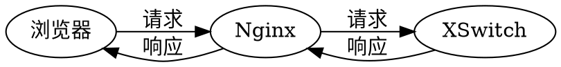

本文以检查XSwitch网页故障为例，其实对其他网络问题也通用。

假设你登录以下网址时遇到故障无法登录：

https://demo.xswitch.cn/admin.html

用Chrome浏览器（微软Edge浏览器也类似）打开上述网址，按F12键，或右键点击网页，然后选择【审查元素】菜单，将会出现类似下面的图，下面就是Chrome开发者工具区域。我的界面是英文的，因此我尝试中英文都进行说明。


切换到【网络】（Network）选项卡，如果能看到很多网址，则最好点一下左起第二个图标（箭头指向的）清除一下，这样看着比较清爽。

点击登录，会看到一个`sessions`请求，如果登录不成功，则会以红色的显示。点击它可以看到详细情况，如下图。


图中，headers为HTTP请求的头域，Request表示请求，可以看到请求的完整网址。Response为响应，其中，Content-Length、Content-Type等一般比较重要。Status Code为状态码，一般有以下取值：

- 200：请求成功
- 403：登录失败，可能是密码不对
- 502：无法访问后台服务，出现在Nginx服务器无法访问上游（`upstream`）服务的情况，在此，上游服务是XSwitch。

上图中的403就是密码不对。点击其它选项卡：

Payload：请求内容

```
{username: "admin", password: "1234"}
```

Preview：预览，服务端返回的数据

```
{username: "admin", password: "1234"}
```

Response：响应，服务端返回的数据

```
{
	"code":	403,
	"text":	"Wrong username or password"
}
```

从上面的数据可以看出，大概率是密码不对。

XSwitch典型的部署架构如下图。如果Nginx到XSwitch的连接中断，则会返回502。




如果你遇到其它故障也可以按此步骤排查。如果你看不懂返回的结果，可以复制结果内容或截图发给XSwitch技术支持工程师排查。

如果你熟悉cURL，你会看到上述的步骤其实类似：

```sh
curl -d '{username: "admin", password: "1234"}' -H "application/json" https://demo.xswitch.cn/api/sessions
```

返回：

```json
{
	"text":	"Wrong username or password",
	"code":	403
}
```

在`curl`命令后加上`-vvv`参数，可能看到更详细的请求和响应头域。

<hr/>

本文主要是以排查XSwitch登录问题为例讲解Chrome Devtools的使用方法，步骤和思路适用于任何跟浏览器相关的问题。如果你确实遇到了XSwitch相关的问题，可以继续参考[在安装或使用XSwitch时遇到问题我该怎么办](https://xswitch.cn/pages/howto/trouble-shoot/) 。
