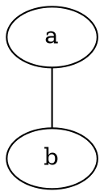

## 什么是Markdown？

- Markdown是一种轻量级标记语言，它允许人们使用易读易写的纯文本格式编写文档。
- Markdown语言在2004年由约翰·格鲁伯（John Gruber）创建。
- Markdown编写的文档可以导出HTML 、Word、图像、PDF、Epub等多种格式的文档。
- Markdown编写的文档后缀为`.md`、`.markdown`。

Markdown是格式简单易学又不失强大的功能，目前主流的文档平台都支持Markdown格式。关Markdown的语法，参见：

- https://markdown.com.cn/cheat-sheet.html
- https://www.zhihu.com/question/19963642

在实际使用时，由于软件和平台的不同，Markdown语言也不尽相同，下面是小樱桃的Markdown规范，请遵照执行。

## 标题中`#`与标题要有一个空格

* 正确：`# 综述`
* 错误：`#综述`

## 标题上下要空一行

正确：

```markdown
# 综述

欢迎使用本文档。
```

错误：

```markdown
# 综述
欢迎使用本文档。
```

## 不需要写章节号

章节号在PDF及Word文档中会自动生成。在我们的Git服务器上，也可以自动生成章节号及目录。

## 中文文档中用中文标点

* 正确：`注意：中文文档中用中文标点，即使在有跟english、other language混排的情况。`
* 错误：`注意:中文文档中有英文标点, 即使在有跟english, other language混排的情况。`

## 中英文混排时中英文间不要加空格

在中、英文间加上适当的距离是排版软件要做的事，而不是要人为的加空格。

* 正确：`使用FreeSWITCH打电话`
* 错误：`使用 FreeSWITCH 打电话`

注：这一条有争议，有人说加上空格排得好看，但是在有大量中英文混排时有大量的空格输入会比较麻烦，所以我们暂时坚持不要加空格。

## 文档末尾至少要有一个空行

如：

`1.md`：

```
# 第一章

内容

```

## 流程图尽量用代码方式生成

这样做的好处是图形和文字在同一个文件中。系统目前支持以下方式，在Gitea上可以看图，在VS Code中有相应的预览插件：

* graphviz
* msc
* markmap

示例代码如下。可以直接在我们的Git网站上显示图片。生成的PDF中也可以自动生成图片（目前尚不支持`markmap`，使用Graphviz代替，不大好看）。

````

````


````
```msc
msc {
    alice [label="Alice"],
    bob [label="Bob", textcolor="red"],

    alice -> bob [label = "INVITE(SDP)"];
}
```
````

```msc
msc {
    alice [label="Alice"],
    bob [label="Bob", textcolor="red"];

    alice -> bob [label = "INVITE(SDP)"];
}
```

````
```markmap
# 思维导图
## 很好
## 很强大
```
````

```markmap
# 思维导图
## 很好
## 很强大
```

相关链接：

* http://graphviz.org/
* http://www.mcternan.me.uk/mscgen/
* https://mscgen.js.org/
* https://markmap.js.org/

freeswitch.org.cn、xswitch.cn、rts.cn上面也支持这种渲染。

## 如果使用其它图片，注意保留源文件

如果使用WPS、Word、PPT、Viso、Keynote、OmniGraffle等方式画图，生成`.jpg`或`.png`图片后可以在Markdown中使用，并请保留源文件。源文件如果比较小，可以Commit到Git仓库中，如果比较大，则在项目完成后归档放到企业网盘中。

## 少用表格

表格排版比较麻烦，尽量少用。可以多用列表或思维导图方式代替。如果不得不用，尽量少用字段比较多的表格。以下网站也能帮助生成Markdown表格：

https://tableconvert.com/

VSCode里也有一个表格插件Markdown Table (TakumiI) 对编辑表格有一些帮助。

## 合理使用元信息

如果最后需要生成PDF，则在文件头部加入元信息（元信息可以在Latex模板中引用），Yaml格式，如：

```
---
title: 设计文档
author: 杜金房
---

# 第一章

# 第二章
```

注意，在这种情况下，文档标题写到`title`元信息里面。所有章节都使用一级标题。

如果标题过长，可以将标题分成两行，但仍保留完成标题，如：

```
---
title: 本文档有一个很长很长的标题以至于会换行
title1: 本文档有一个很长很长的标题
title2: 以至于会换行
author: 杜金房
---

# 第一章

# 第二章
```

## 列表

为保持紧凑，列表项目间不需要有空行。列表中的标点有以下三种方式：

```
* 短句不加标点
* 这样，其实也行
```

```
* 比较长的句子可以加句号。
* 但要注意：或者都加，或都都不加。
* 不要有的加有的不加。
```

```
* 有时候，可以用分号；
* 并在最后一条上用句号；
* 但不推荐使用这种方式，因为如果后面你想在最后再加上一条，有时忘了将上一条的句号改成分号。
```

## 其它

* 文档内容至少要在小樱桃Gitea上正常显示。
* 并能配合相应模板生成正确的PDF。
* 在Gitea上，可以点击本文档右上方的编辑按钮查看文档源文件。
* 其它可参见[中文技术文档写作规范](http://www.freeswitch.org.cn/blog/2022/06/document-style-guide/)，该规范仅供参考，但我们并不是完全按这个规则来。

## 限制

* 目前在我们的Git页面上不支持预览时看图。
* 目前Markmap的图尚不支持在PDF中生成，少用。

# 文档生成

可以使用Pandoc和Latex生成Word、HTML和PDF文档。为了方便使用，我们制作了Latex Docker镜像。

- ccr.ccs.tencentyun.com/free/pandoc:multiarch：最新版的Docker镜像，支持ARM64和AMD64，包含`mscgen`
- ccr.ccs.tencentyun.com/free/texlive_pandoc:m1：Apple M1版Docker镜像，包含`mscgen`
- ccr.ccs.tencentyun.com/free/texlive_pandoc：旧版Docker镜象

旧版Docker镜象不包含`mscgen`，推荐使用第一个镜象。但第一个镜象不支持`zhspacing`，所以如果旧的文档编译出错，可以把`template`里的`zhspacing`相关的行注释掉。

使用方法：

```
docker run --rm -it -v ${PWD}/..:/team ccr.ccs.tencentyun.com/free/pandoc:multiarch bash
cd src # 根据情况看是否需要
make
```

# 文档共享

把文档上传到微信网盘，在macOS上的路径是：`~/Library/Containers/com.tencent.WeWorkMac/Data/WeDrive/小樱桃科技/`

可以直接通过网盘上传，或通过Makefile实现，如：

```makefile
DEST := ~/Library/Containers/com.tencent.WeWorkMac/Data/WeDrive/小樱桃科技/项目与方案/解决方案/


install:
	cp ../pdf/xswitch-*.pdf $(DEST)
```

**注意**：如果目标文件在网盘上已存在，则必须下载后才能覆盖，或者，可以在`make install`前将网盘上的目标文件删除。
